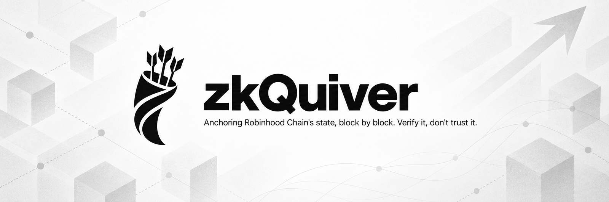

<div align="center">



<br>

[](https://github.com/zkQuiver/zkQuiver/actions/workflows/ci.yml)
[](LICENSE)
[](https://docs.robinhood.com/chain/)
[](contracts/ProofAnchor.sol)
[](orchestrator/src/kats.js)

**[Website](https://github.com/zkQuiver/zkQuiver) · [How it works](#how-it-works) · [Quickstart](#quickstart) · [Verify it yourself](#verify-it-yourself) · [Roadmap](#roadmap)**

<br>

*Anchoring Robinhood Chain's state, block by block. Verify it, don't trust it.*

</div>

---

## What is zkQuiver?

Robinhood Chain validates state with a whitelisted fraud-proof validator
set. zkQuiver adds an independent verification layer: it anchors
cryptographic proof records of block-window state transitions on-chain,
so anyone can verify the chain's state lineage without trusting the
permissioned validator set. Provers stake into a Validator Lock escrow to
participate, creating an economic engine around proof production.

## How it works

Every proof covers a **block window**, a contiguous range of blocks. For
each window, the pipeline produces an *artifact* (a small JSON document
committing to the state before and after the window), hashes it,
wraps that hash in a domain-separated message signed by the aggregator
key, and writes an immutable record on-chain. Records must arrive in
strict sequence with no gaps or overlaps, so the chain of anchored
windows forms an unbroken, independently checkable state lineage from
block 1 onward.

```
 Prover (Rust)          Orchestrator (TS)        ProofAnchor.sol          Indexer (TS)
 ─────────────          ─────────────────        ───────────────          ────────────
 canonical JSON   ──▶   validate + store   ──▶   verify aggregator  ──▶   events → Postgres
 blake3 proof_hash      build DS message         ECDSA sig (ecrecover)    latest → safe →
 sign DS (secp256k1)    submit via ethers        seq monotonicity         finalized tracking
 [SP1/RISC Zero          idempotency keys        contiguous windows
  proof gen]                                     pluggable IProofVerifier
```

### 1. Artifacts and canonicalization

An artifact commits to one window:

```json
{
  "artifact_id": "550e8400-e29b-41d4-a716-446655440000",
  "start_block": 1,
  "end_block": 64,
  "state_root_before": "…hex32…",
  "state_root_after": "…hex32…"
}
```

Artifacts are canonicalized deterministically (JCS rules: lexicographically
sorted keys, no whitespace, lowercase hex, no scientific notation), then
hashed: `proof_hash = blake3(canonical_json_bytes)`. Canonicalization is
implemented identically in TypeScript and Rust so both sides always agree
on the hash.

An optional **Public Inputs v2** set strengthens what the record binds to:
`C_in`/`C_out` (state commitments at window boundaries), `H_B` (digest over
per-block state roots), and `S_in`/`S_out` (touched account→value pairs at
window start/end). Its canonical hash is stored on-chain as
`publicInputsHash`, giving a durable receipt that ties the proof to a
well-defined state claim.

### 2. Domain separation

The signature never covers a bare hash, it covers a 98-byte
domain-separated (DS) message that binds the proof to this exact chain,
contract, window, and position in the sequence, preventing replay across
chains, contracts, or sequence positions:

```
┌──────────┬────────┬──────────────────────────────────┐
│ Offset   │ Length │ Field                            │
├──────────┼────────┼──────────────────────────────────┤
│   0      │   14   │ ASCII prefix "zkRH/anchor/v1"    │
│  14      │    8   │ chainId (u64 BE)                 │
│  22      │   20   │ ProofAnchor contract address     │
│  42      │   32   │ proof_hash (blake3)              │
│  74      │    8   │ startBlock (u64 BE)              │
│  82      │    8   │ endBlock (u64 BE)                │
│  90      │    8   │ seq (u64 BE)                     │
└──────────┴────────┴──────────────────────────────────┘
                     Total: 98 bytes
        ds_hash = keccak256(DS), signed EIP-191 by the aggregator
```

Three implementations construct this message, Solidity
(`computeDsHash`), TypeScript (`ds.ts` logic in `canonical.ts`), and Rust
(`prover/src/main.rs`), and must be byte-identical. The orchestrator
cross-checks its locally computed `ds_hash` against the contract's view
function before every submission, so a drift between implementations
fails closed instead of anchoring garbage.

### 3. On-chain anchoring (`ProofAnchor.sol`)

`anchorProof` enforces, in order:

- contract not paused
- `proof_hash` not previously anchored
- `seq == lastSeq + 1` (first proof is seq 1, strict monotonicity)
- `startBlock == lastEndBlock + 1` (contiguous windows, first starts at 1)
- `endBlock − startBlock + 1 ≤ 2048` (bounded window size)
- `ecrecover` of the EIP-191 signature over `ds_hash` resolves to the
  current aggregator, or to `nextAggregator` once `seq ≥ activationSeq`,
  enabling zero-downtime key rotation
- if a verifier is configured, the attached ZK proof must pass

On success it writes a `ProofRecord` (hashes, state roots, window,
submitter, timestamp, verification status) and emits `ProofAnchored`,
which is the indexer's data source.

**Validator Lock.** Operators call `registerValidator()` to escrow a fixed
amount of an ERC-20 lock token; `unlockValidator()` releases it. Active
validators accrue `numAccepts` per anchored proof, the hook for future
reward distribution and slashing.

### 4. Pluggable ZK verification

`IProofVerifier` is a one-function interface:

```solidity
function verify(bytes calldata proof, bytes32 publicInputsHash) external view returns (bool);
```

With no verifier set, the system runs in hash-anchoring mode: integrity
rests on the aggregator signature. Setting a verifier upgrades the trust
model to cryptographic: adapters can wrap SP1's `verifyProof`, RISC Zero's
`verify`, or a Groth16 verifier, binding the proof's public values to
`publicInputsHash`. Because Robinhood Chain is fully EVM-compatible, these
audited verifier contracts deploy unmodified. A `NoopVerifier` stub is
included for local end-to-end testing only.

### 5. Prover

The Rust prover canonicalizes the artifact, computes the blake3
`proof_hash`, builds the 98-byte DS message, keccak-hashes it, signs the
EIP-191 digest with the aggregator's secp256k1 key (emitting a standard
65-byte r‖s‖v signature), and writes a signed artifact for the
orchestrator. Real proof generation lives behind the `zkvm` feature flag , 
the intended path is an SP1 or RISC Zero guest program that checks the
state-transition claim over the window, with the journal committing to the
Public Inputs v2 set.

### 6. Orchestrator

A REST service handling the artifact lifecycle:

| Method | Path                  | Purpose                              |
| ------ | --------------------- | ------------------------------------ |
| POST   | `/artifact`           | Validate, canonicalize, store        |
| POST   | `/anchor`             | Build DS, sign, submit on-chain      |
| GET    | `/proof/:artifact_id` | Query proof status                   |
| GET    | `/health`             | Service health                       |

All mutating endpoints require an `Idempotency-Key` header; repeated keys
return the original result rather than double-submitting. Artifacts are
persisted at `ARTIFACT_DIR/YYYY/MM/DD/{artifact_id}.json` in canonical
form.

### 7. Indexer and finality tracking

The indexer subscribes to `ProofAnchored` events (with polling fallback
and a persisted cursor for crash recovery) and upserts records into
Postgres. Each record carries a commitment level that upgrades as the
containing block moves through EVM block tags:

- `0`, included (`latest`)
- `1`, safe (`safe`)
- `2`, finalized (`finalized`, i.e., the batch has L1 Ethereum finality)

## Repo layout

```
contracts/
  ProofAnchor.sol              core anchoring + Validator Lock escrow
  interfaces/IProofVerifier.sol
  verifiers/NoopVerifier.sol   testing stub, replace with a zkVM adapter
orchestrator/                  REST API + canonicalization/DS library
prover/                        Rust: canonicalize, blake3, DS, secp256k1 sign
indexer/                       events → Postgres with finality reconciliation
scripts/deploy.ts              Hardhat deployment
```

## Quickstart

Full step-by-step with expected outputs: [RUNBOOK.md](RUNBOOK.md).

```bash
npm run doctor        # preflight: node version, zero-dep suites, .env, next step
npm install
npx hardhat test      # contracts + on-chain ZK verifier on an in-memory chain

# Robinhood Chain testnet (chain ID 46630, ETH gas). Faucet:
# https://faucet.testnet.chain.robinhood.com. Put a FRESH wallet's key in .env.
cp .env.example .env
npm run deploy:testnet   # token -> ProofAnchor -> LineageVerifier, wired
npm run anchor:testnet   # first ZK-verified record, prints explorer link
```

Services (orchestrator generates the ZK bundle for every anchor and puts
commitment digests on-chain, never the roots):

```bash
npm --prefix orchestrator install && npm --prefix orchestrator run dev
psql $DATABASE_URL -f indexer/migrations/001_init.sql
npm --prefix indexer install && npm --prefix indexer run dev
cargo build --release --manifest-path prover/Cargo.toml
```

Robinhood Chain RPC endpoints and chain IDs: https://docs.robinhood.com/chain/

## Deployments

| Network | Contract | Address |
| --- | --- | --- |
| Robinhood Chain testnet (46630) | ProofAnchor | [`0x633F2ebbD04F0E9a7aa89Cb703b70b8F85Dd1271`](https://explorer.testnet.chain.robinhood.com/address/0x633F2ebbD04F0E9a7aa89Cb703b70b8F85Dd1271) |
| Robinhood Chain testnet (46630) | LineageVerifier | [`0x338EcB7d484fe882Da93ee40d82B5413a279665c`](https://explorer.testnet.chain.robinhood.com/address/0x338EcB7d484fe882Da93ee40d82B5413a279665c) |

The verifier is wired: every anchor must carry a valid zero-knowledge bundle.

ZK-verified anchors (`zkVerified = true`, each linked to the previous in zero knowledge):
- seq 2, blocks 65 to 128: [`0xde4178998c426dfe…`](https://explorer.testnet.chain.robinhood.com/tx/0xde4178998c426dfef82f2f733ad84083d5e6225e77ca97be77245c089cb082ce)
- seq 1, blocks 1 to 64:
[`0x98e8fdca28754d23…`](https://explorer.testnet.chain.robinhood.com/tx/0x98e8fdca28754d23ebc5752484781e67676bedcc348a33a7c5d68c94e244a372)

## Verify it yourself

Every claim in this README is testable, with zero setup for the first step:

```bash
node orchestrator/src/kats.js   # no dependencies, 17 known-answer tests:
                                # keccak-256 vectors, canonical JSON,
                                # the 98-byte DS layout, replay binding
npm install && npx hardhat test # full contract lifecycle on an in-memory
                                # chain: escrow, anchoring, every rejection
                                # rule, rotation, verifier hook, and the
                                # computeDsHash conformance cross-check
```

The same 17-assertion suite is embedded in the website and runs in your
browser. CI runs all of it on every commit, the badge above is live.

## Zero-knowledge sigma layer

The repo now includes a working zero-knowledge layer (`zk/`), built from
first principles with zero dependencies: Pedersen commitments hide the
state roots, NIZK proofs of opening (Okamoto) show the commitments are
well-formed, and a Chaum-Pedersen proof links consecutive windows'
boundary commitments without revealing the roots. `LineageVerifier.sol`
verifies the full bundle on-chain (affine secp256k1 ops plus the
ecrecover multiplication trick) and plugs into `ProofAnchor` via
`setVerifier`. Run it yourself, nothing to install:

```bash
node zk/selftest.js   # correctness, soundness (tamper/forgery), privacy
node zk/prove.js      # emit an on-chain-ready proof bundle
```

Scope, stated plainly: this proves commitment structure and lineage
linkage in zero knowledge. It does not prove the state transition itself
is correct; that is the zkVM tier on the roadmap.

## Keys and privacy

No private keys exist in this repository. Keys live only in a local `.env`
(git-ignored, excluded from release packages); `npm run doctor` and CI both
fail if key-shaped material appears anywhere else. The website holds no
keys and performs read-only calls. On-chain records carry commitment
digests, never state roots. Full policy, role separation, and rotation
procedure: [SECURITY.md](SECURITY.md).

## Honest status

The anchoring protocol is real and testable today: signatures bind,
replays fail, the window chain is unbroken. The zero-knowledge layer is
a pluggable slot, until a zkVM adapter fills it, records are secured by
the aggregator signature, not by a proof. See the roadmap.

## Token & prover economics

Verifiable computation isn't free: zkVM proving is compute-heavy, and every
anchor costs gas. The zkQuiver token funds this directly. A **3% tax on
buys and sells** routes to the **prover treasury**, which pays for
proof-generation compute (the Phase 3 SP1/RISC Zero provers), anchoring
gas, and orchestrator/indexer infrastructure. Until the ZK layer ships,
the treasury accrues toward proving infrastructure. The tax lives in the
token contract, separate from this repo; the treasury address and flows
will be published on-chain.

## Roadmap

**Phase 1, Anchoring protocol (live):** contract, DS signing, escrow,
orchestrator, indexer, conformance suite in CI.
**Phase 2, Testnet deployment:** ProofAnchor on Robinhood Chain testnet;
the website's verify button gains an on-chain `computeDsHash` cross-check.
**Phase 3, Zero-knowledge layer:** zkVM adapter + guest program, treasury-
funded proving.
**Phase 4, Permissionless proving:** open prover market with slashing and
treasury rewards.

Remaining engineering items:

- [ ] SP1 or RISC Zero adapter implementing `IProofVerifier`, with the
      guest program checking state-transition claims over the block window
- [ ] Public Inputs v2 bound into the zkVM journal, not just hashed alongside
- [ ] Aggregator key rotation ceremony (`scheduleAggregatorRotation` exists)
- [ ] Permissionless prover market: any Active validator may submit;
      slash the lock on invalid submissions once the verifier is live
- [ ] TS↔Rust↔Solidity conformance suite in CI
- [ ] Grafana/Prometheus dashboard off the indexer DB

## License

Apache-2.0
